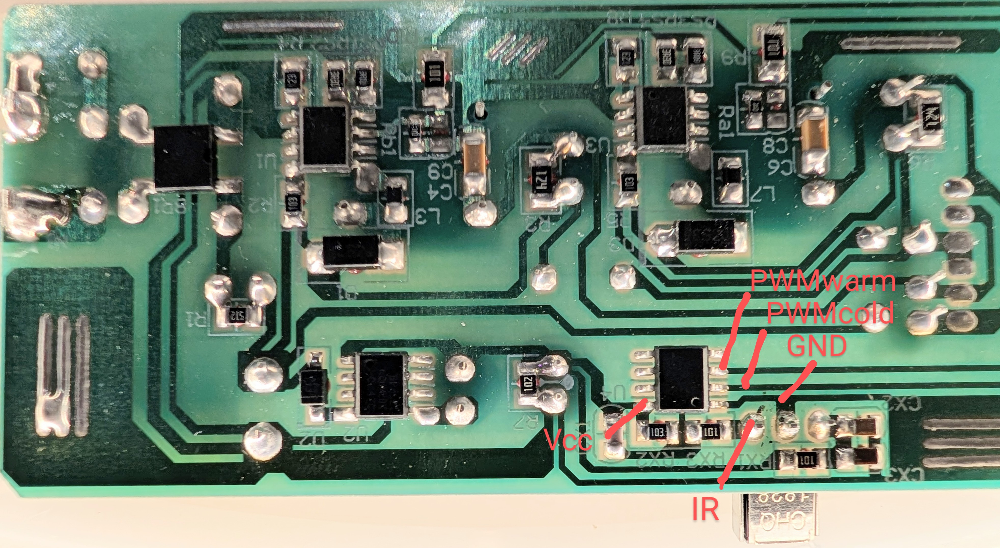
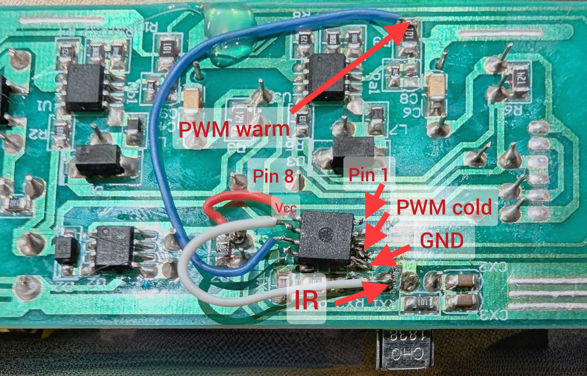

# LED Lighting Controller

| ⚠️ **WARNING: MAINS POWER SAFETY** ⚠️ |
|---------------------------------------|
| Working with mains power is extremely dangerous and can result in serious injury, electric shock, or death. |
| - **Disconnect all connections to mains power** before starting any work on this project. |
| - This PCB does **not** provide galvanic isolation. Be aware that the low-voltage components connected to the circuit may be at mains potential. |
| - Only proceed if you have adequate knowledge of electrical safety and experience working with high-voltage systems. |
| - Consider consulting a qualified electrician if in doubt. |
| **Proceed at your own risk.** |

This project aims to enhance the functionality of a lighting unit originally produced by Lidl™'s LIVARNO™ brand (Type 0452602). The original unit uses an unbranded 8-pin microcontroller for control, which does not retain its settings when mains power is switched off. This project replaces the original processor with an ATtiny™85 microcontroller to add persistent storage of settings and maintain compatibility with the original IR remote control.

## Features

- **IR Remote Control**: Full support for controlling the lighting unit via an NEC™ protocol-compatible IR remote control.
- **Independent Control**: Adjust cold white and warm white LED strings independently.
- **Brightness and Color Adjustment**:
  - Smooth fading between color temperatures.
  - Adjustable brightness levels.
- **Persistent Settings**:
  - Store color and brightness settings in EEPROM.
  - Reload saved settings after power cycling.
- **Night Mode**: Activate a low-intensity nightlight setting.
- **Preset Support**: Quickly switch between predefined color and brightness presets.

## Hardware Requirements

- **Microcontroller**: ATtiny85 running at 8 MHz with built-in EEPROM for setting storage.
- **LED Channels**:
  - Cold white LED string connected to PB1 (PWM output).
  - Warm white LED string connected to PB4 (PWM output).
- **IR Receiver**:
  - NEC-compatible IR receiver connected to PB2.

## Pin Configuration

| Pin   | Function                 |
|-------|--------------------------|
| PB1   | Cold white LED PWM       |
| PB2   | IR receiver input        |
| PB4   | Warm white LED PWM       |

## Key Functionality

- **IR Commands**:
  - Power toggle (on/off).
  - Adjust brightness (increase/decrease).
  - Change color temperature (colder/warmer white).
  - Activate nightlight mode.
  - Store and recall settings.
  - Quickly set brightness levels (10%, 50%, 100%).

- **Fading**:
  - Smooth transitions between brightness levels and color temperatures.

## Development Notes

- **Microcontroller Programming**:
  - The ATtiny85 is programmed using an ISP programmer, bypassing the default bootloader.
- **Development Board**:
  - The project was developed using a Digispark ATtiny85 board for initial testing.
- **PWM Configuration**:
  - Timer1 is used for generating PWM signals with 8-bit resolution.

## How It Works

1. **Startup**:
   - The program initializes the ATtiny85, loads stored settings from EEPROM, and fades in the LED strings to the last saved state.

2. **IR Command Processing**:
   - The IR receiver decodes commands from the remote control, which are processed to adjust brightness, color temperature, or mode.

3. **Persistent Storage**:
   - Settings are stored in EEPROM to ensure they are retained after power loss.

4. **PWM Control**:
   - Independent PWM signals are generated for the cold and warm white LED channels, enabling precise brightness control.

## Installation

1. **Programming**:
   - Flash the provided program onto the ATtiny85 using an ISP programmer.

2. **Hardware Setup**:
   - Replace the original microcontroller with the ATtiny85.
   - Connect the LEDs and IR receiver to the appropriate pins as described above.

3. **Testing**:
   - Use the original IR remote control to verify functionality.

## Acknowledgments

This project enhances the LIVARNO™ LED lighting unit by adding modern functionality while maintaining compatibility with its original design. The ATtiny™85 microcontroller provides an efficient and reliable solution for embedded systems with limited resources.

## License

This project is open-source and available under the MIT License.
